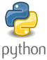

<h1>Aulas Introdução à Programação com Python </h1>
<h3>Aulas Python com a DIO  Digital Innovation One</h3> 

   

<ul type="circle">
	<li>variáveis e operadores</li>
	<li>laços de repetição com Python</li>
	<li>lista, tupla e conjunto</li>
	<li>métodos, funções e classes</li>
	<li>módulos, importação de funções, lambda</li>
</ul>
  
&reg; 06/2020 <a href="https://digitalinnovation.one/cursos/introducao-a-programacao-com-python/?ref=lp&hidden_text&source=/skills/python&">Curso Introdução à Programação em Python na DIO</a>
